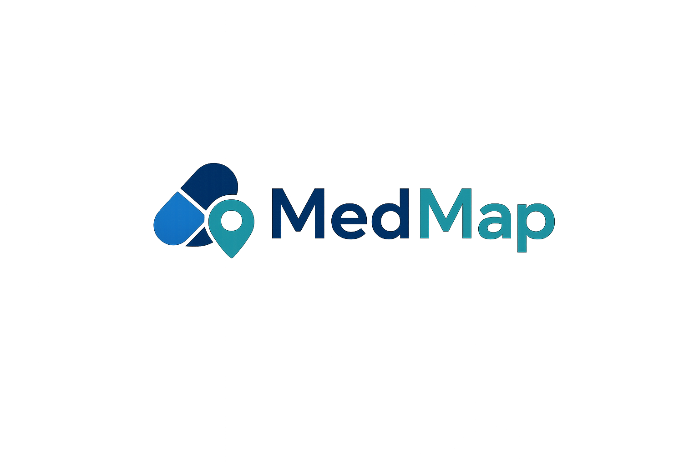
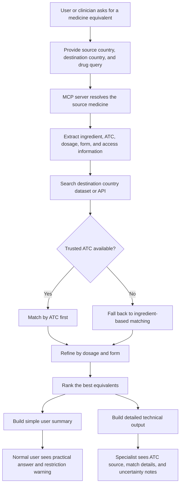

  

# MedMap

MedMap is a cross-country medicine equivalence engine.

It helps answer a simple question:

> If I know a medicine in one country, what is the closest equivalent in another country?

This is useful for travelers, patients, clinicians, and digital health tools working across different national medicine systems.

## ✈️ Personal Story

The idea came from a personal experience while traveling from Italy to France.

In Italy, I knew `Tachipirina`. In France, I was given `Doliprane 1000`, which is essentially the same medicine family. But that created an immediate problem for me: in Italy, the `1000 mg` dosage is typically associated with stricter prescription rules, so I was not sure whether I should treat it as a normal equivalent or as something that needed extra caution.

That confusion was the starting point for MedMap.

A medicine that feels simple in one country can become confusing in another:

- the brand name changes
- the strength may be sold differently
- the available forms may change
- prescription rules may not be the same

MedMap was built to reduce that confusion in a structured and safer way.

## 🎯 What MedMap Does

Given:

- a source country
- a destination country
- a medicine query

MedMap:

1. finds the medicine in the source country
2. identifies its ingredient, dosage, form, and access information
3. searches the destination country dataset
4. finds the closest equivalent medicines
5. explains whether the match is exact, close, or only a broader alternative

The goal is not just to find a similar name. The goal is to preserve the important medical details behind the medicine.

## 🔄 User Flow

## 🧭 How It Matches Medicines

MedMap tries to match medicines using the safest available signals:

- ATC code, when available
- active ingredient
- dosage
- form

This means it does not rely on brand names alone.

If a trusted ATC code is available, that is used first.
If ATC is missing, MedMap falls back carefully to ingredient-based matching and clearly reports that to the user.

## 🌍 Countries Currently Supported

- Italy
- France
- UK
- Spain

## 🗂️ Data Sources

MedMap currently uses:

- Italy: AIFA
- France: BDPM
- UK: dm+d plus BNF-linked ATC support
- Spain: CIMA API

Official dataset sources:

- Italy (AIFA): https://www.aifa.gov.it/web/guest/liste-dei-farmaci
- France (BDPM): https://base-donnees-publique.medicaments.gouv.fr/telechargement
- UK (NHS dm+d / TRUD): https://isd.digital.nhs.uk/trud/user/guest/group/0/pack/6/subpack/24/releases
- Spain (AEMPS / CIMA): https://sede.aemps.gob.es/datos-abiertos/

Optional convenience bundle for deployment or local setup:

- https://pub-bfd515f1bc1a4c079a3db731bf46d3d4.r2.dev/Datasets.zip

## 👥 Output for Two Audiences

MedMap is designed for both specialists and non-specialists.

### 🙂 Simple User Summary

For normal users, the output includes a top-level summary that answers questions like:

- Is there a likely equivalent?
- Is it an exact match or only a close alternative?
- Does it appear to need a prescription?
- Is there any dosage or form difference to be careful about?

### 🩺 Detailed Professional Output

For technical and clinical review, the output also includes:

- resolved source record
- ingredient details
- ATC and ATC source
- dosage and form comparison
- access information
- notes about uncertainty or fallback logic

## ✅ What Makes It Useful

- works across different naming systems
- supports brand and generic queries
- keeps dosage and formulation in the matching logic
- reports uncertainty instead of hiding it
- includes access and prescription-related information

## ⚠️ Challenges

Building MedMap required dealing with:

- fragmented national datasets
- different file formats
- different naming systems across countries
- missing ATC values in some source records
- medicine forms that do not map perfectly across countries

A major design choice in this project was to avoid unsafe guessing and make the matching logic explainable.

## 🚀 Current Direction

MedMap is evolving toward a reusable healthcare interoperability tool.

Current focus areas include:

- safer ATC enrichment where national datasets are incomplete
- clearer user-facing summaries
- support for MCP-based integrations
- compatibility with FHIR-oriented platforms

## 🛠️ Built With

- Python
- Pandas
- XML parsing
- REST APIs
- MCP server architecture

## 📌 Important Note

MedMap is a medicine mapping and equivalence support tool. It is not a substitute for clinical judgment, pharmacist review, or local prescribing guidance.
